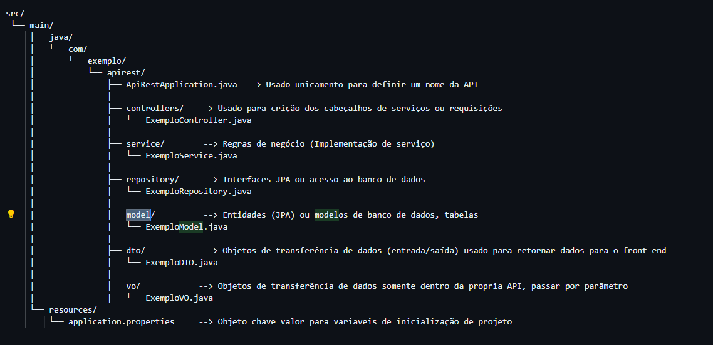

# COMO CRIAR O PROJETO BACK-END
```
SITE: https://start.spring.io/

Project: Maven

Language: Java

Spring Boot: 3.2+

Group: com.exemplo

Artifact: apirest

Dependencies:
  -> Spring Web
  -> Spring Boot DevTools
```
# ESTRUTURA DO PROJETO BACK-END JAVA SPRING BOOT



# EXEMPLO DE CHAMADA DE REQUISIÇÃO EM JAVASCRIPT

```js
 const dados = {
      usuario: "seuUsuario",
      senha: "suaSenha"
    };

    fetch("http://localhost:8080/autenticar/usuario", {
      method: "POST",
      headers: {
        "Content-Type": "application/json"
      },
      body: JSON.stringify(dados)
    })
      .then(response => {
        if (!response.ok) {
          throw new Error(`Erro na requisição: ${response.status}`);
        }
        return response.json(); // ou .text() dependendo do retorno da API
      })
      .then(data => {
        console.log("Resposta da API:", data);
      })
      .catch(error => {
        console.error("Erro ao fazer a requisição:", error);
      });

```
# EXEMPLO DE SERVIÇO EM JAVA SPRING BOOT

```java
import com.example.apirest.dto.AutenticacaoDTO;
import com.example.apirest.service.AutenticacaoService;
import org.springframework.http.ResponseEntity;
import org.springframework.web.bind.annotation.*;

@RestController
@RequestMapping("/autenticar")
@CrossOrigin(origins = "*")
public class AutenticacaoController {
   
    @PostMapping("/usuario")
    public ResponseEntity<?> usuario(@RequestBody AutenticacaoDTO autenticacaoDTO) {
        AutenticacaoService service = new AutenticacaoService();
        Object resposta = service.autenticar(autenticacaoDTO);
        return ResponseEntity.ok(resposta);
    }
}

```


# BANCO DE DADOS CHAMADA EM JAVA

PRIMEIROS PASSO
```
  1 - COPIAR O ARQUIVO driver_banco_dados/mssql-jdbc_auth-12.10.0.x64.dll para a pasta C:\drivers\sqljdbc
  
  2 - COM O BOTÃO DIRETO DO MAUSE, CLIQUE EM CIMA DO PROJETO PRINCIPAL NO NETBEANS, VA EM PROPRIEDADES > RUN > VM OPTIONS > E ADICIONE ESSA LINHA
        -Djava.library.path=C:\\drivers\\sqljdbc

  3 - ADICIONE ESSES PROJETOS DENTRO DE dependencies DO ARQUIVO POM.XML

              <dependency>
                    <groupId>jakarta.persistence</groupId>
                    <artifactId>jakarta.persistence-api</artifactId>
                    <version>3.1.0</version>
                </dependency>
                
                <dependency>
                    <groupId>com.microsoft.sqlserver</groupId>
                    <artifactId>mssql-jdbc</artifactId>
                    <version>12.10.0.jre11</version>
                    <scope>compile</scope>
                </dependency>            

                <dependency>
                    <groupId>org.springframework.boot</groupId>
                    <artifactId>spring-boot-starter-data-jpa</artifactId>
                </dependency>

  4 - CRIE AS PASTAS REPOSITORY, E DENTRO DESSA PASTA CRIE AINDA AS PASTAS CUSTOM, IMPL

  5 - DENTRO DA PASTA RESOURCES NO ARQUIVO APPLICATION.PROPERTIES ADICIONE AS LINHAS ABAIXO:

      # Configurações de conexão com o banco de dados
      #spring.datasource.url=jdbc:sqlserver://localhost:1433;databaseName=BANCO_DADOS
      #spring.datasource.username=username
      #spring.datasource.password=password
      #spring.datasource.driver-class-name=com.microsoft.sqlserver.jdbc.SQLServerDriver

      # Habilitar o uso do JPA

      spring.datasource.url=jdbc:sqlserver://USUARIO;databaseName=BANCO_DADOS;integratedSecurity=true;encrypt=true;trustServerCertificate=true
      spring.datasource.driver-class-name=com.microsoft.sqlserver.jdbc.SQLServerDriver
      spring.jpa.hibernate.ddl-auto=none
      spring.jpa.show-sql=true
      spring.jpa.properties.hibernate.dialect=org.hibernate.dialect.SQLServerDialect

      java.library.path=path/to/dll

      spring.aot.enabled=false


```

USO


```JAVA

public interface UsuarioRepositoryCustom {
     public boolean inserirUsuario(UsuarioDTO usuarioDTO);
}

```

```JAVA

@Repository
public interface UsuarioRepository extends JpaRepository<UsuarioModel, Long>, UsuarioRepositoryCustom{
    
}

```


```JAVA
@Repository
public class UsuarioRepositoryImpl implements UsuarioRepositoryCustom {

    @PersistenceContext
    private EntityManager entityManager;
    
    @Override
    @Transactional
    public boolean inserirUsuario(UsuarioDTO usuarioDTO){
         String sql = "INSERT INTO TB_USUARIO(TX_NOME, TX_SENHA) VALUES ";
         sql += "(:nome, :senha);";
                 
        Query query = entityManager.createNativeQuery(sql);
        query.setParameter("nome",usuarioDTO.getNome());
        query.setParameter("senha",usuarioDTO.getSenha());
        query.executeUpdate();
                  
        return true;       
    }
}

```

# BANCO DE DADOS TABELA
```SQL
CREATE TABLE TB_USUARIO (
    id INT IDENTITY(1,1) PRIMARY KEY,
    TX_NOME VARCHAR(100),
    TX_SENHA VARCHAR(100)
);

```